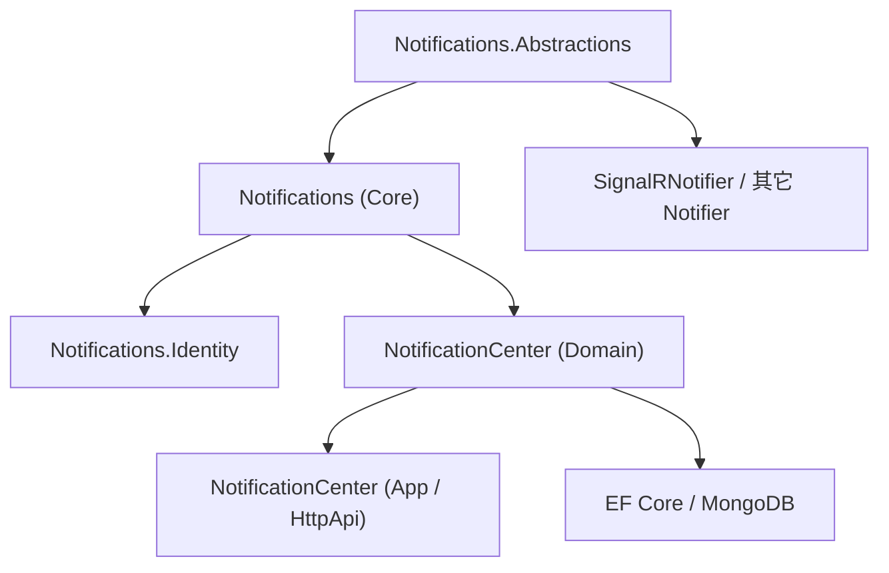
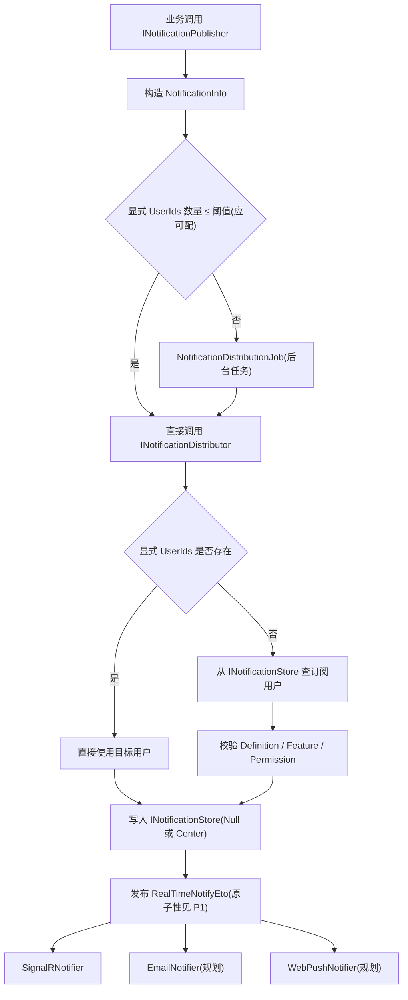

# 02 · 目标架构

现有实现的整体形状是好的(事件驱动、可插拔、Null Object、核心/实现分离),新仓库沿用这个骨架,但要在契约、可靠性、生命周期上做对(见 `03-roadmap.md`)。

## 1. 分层

```text
Dignite.Abp.Notifications.Abstractions  统一数据模型与分布式事件契约(NotificationData / RealTimeNotifyEto 等)
            ↓
Dignite.Abp.Notifications               核心:定义、发布、订阅、分发、Store 抽象、发布 RealTimeNotifyEto
            ↓
可插拔 Notifier                          SignalR(现有)/ Email / WebPush / FCM / APNs / SMS / Webhook(规划)

旁挂:
Dignite.Abp.Notifications.Identity       NotificationDefinitionManager 的权限实现(基于 ABP Identity/Authorization)
Dignite.Abp.NotificationCenter           可选:INotificationStore 实现 + 持久化 + 订阅 + 收件箱 + REST API(EF Core / MongoDB);UI 由使用方基于 API 自建
```

要点:

- **Notifier 只依赖 Abstractions**,不依赖核心、不依赖 Notification Center。
- **Notification Center 是可选的应用实现**,不是通知机制存在的前提。
- **核心通过 `INotificationStore` 解耦持久化**;不装 Center 时用 `NullNotificationStore`。

## 2. 依赖方向



这是合理的依赖倒置:SignalR Notifier 甚至只需 Abstractions 事件契约;Identity 是可替换的权限实现;Center 提供 Store 实现,并以 headless REST API 暴露收件箱/订阅,UI 由使用方自建。

## 3. 两种运行模式

### 3.1 无状态转发模式

安装:`Dignite.Abp.Notifications` + 一个或多个 Notifier。

- 显式指定目标用户;`NullNotificationStore` 不持久化;
- 核心仍产生 `RealTimeNotifyEto`;Notifier 转发给用户;
- 无订阅、收件箱、已读态。

### 3.2 完整通知中心模式

安装:`Dignite.Abp.Notifications` + `Dignite.Abp.NotificationCenter` + Notifier。

- 增加通知存储、用户收件箱、订阅、已读未读、REST API、EF Core / MongoDB;UI 由使用方基于 API 自建(headless)。

## 4. 核心流程



**关键解耦点是 `RealTimeNotifyEto`**,它同时是:核心与 Notifier 的边界、单体与分布式部署的边界、新 Notifier 的扩展入口。

> 注意流程中两处已知问题,须在新实现里做对:阈值应可配(现为硬编码常量);"写库 → 发事件"两步应原子(现无 Outbox 保证)。详见 `03-roadmap.md`。

## 5. 主要扩展点

| 扩展点 | 作用 |
|---|---|
| `INotificationPublisher` | 发布入口(≤阈值直发,否则后台任务) |
| `INotificationDistributor` | 解析用户、校验、写 Store、发 ETO |
| `INotificationStore` | 持久化抽象(Null / Center 两实现) |
| `INotificationDefinitionProvider` | 业务模块注册自己的通知类型 |
| `INotificationDefinitionManager` | 定义注册表 + 可用性(Feature/Permission)判定,抽象权限检查 |
| `INotificationSubscriptionManager` | 订阅管理 |
| `IUserNotificationManager` | 用户通知(收件箱/已读态)管理 |
| **Notifier** | 实现为 `IDistributedEventHandler<RealTimeNotifyEto>`;建议再引入显式 `INotificationNotifier`(见 P2) |

> 去掉 Blazor 后不再有服务端"按类型选组件"的扩展点;**渲染提示改为由契约承载**——每条 NotificationData 带稳定判别名 + 展示提示(图标 key / 标题模板),前端(JS/TS 或使用方自建 Blazor)据此渲染。

## 6. 通道路由(设计预留)

当前是"所有订阅 `RealTimeNotifyEto` 的处理器都收到事件"的广播式扩展,适合多通道并行。若未来需要"某条通知只走 SignalR + Web Push、不走 Email",在现有契约上**增量**扩展即可,不新增核心层:

- 用 `NotificationDefinition.Attributes`(已有)承载通道白名单;
- 或在 `NotificationData` 里带投递提示;
- 或引入 Notifier Name / Channels 的路由策略。
