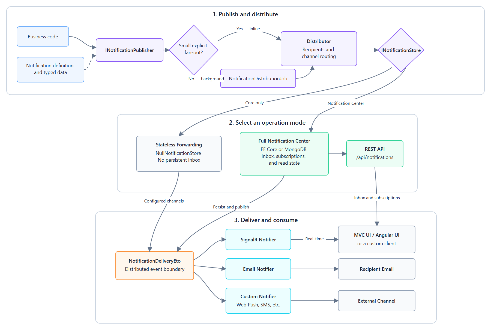
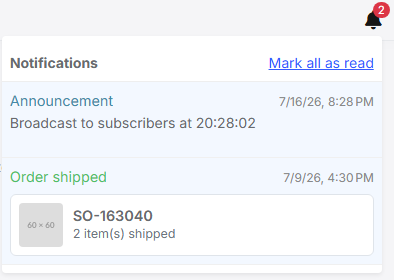

# Introducing Dignite ABP Notifications: An Extensible Notification Center for ABP Applications

Notifications often begin as a small requirement: show a message when something important happens.
Then the application needs recipient selection, real-time delivery, email, read/unread state,
subscriptions, persistence, multi-tenancy, and different user interfaces. At that point, a simple
message sender has become a subsystem.

[Dignite ABP Notifications](https://github.com/dignite-projects/abp-notifications) is an open-source,
event-driven notification framework built for the ABP Framework. It separates notification delivery
from the persistent inbox, so an application can start with lightweight real-time forwarding and add
a full Notification Center only when it needs one.

## Background

This project did not start from a blank page. `Dignite.Abp.Notifications` was split out of
[Dignite ABP](https://github.com/dignite-projects/dignite-abp), a broader collection of ABP add-ons
(notifications, dynamic forms, a file manager, a theme, and more). That project is no longer
actively maintained, so the notification module now lives in its own dedicated repository, as a
from-scratch rewrite with its own versioning, test suite, and release pipeline — not an in-place
upgrade of the old package.

The design itself traces back further, to the notification module that shipped with
[ASP.NET Boilerplate](https://github.com/aspnetboilerplate/aspnetboilerplate/tree/dev/src/Abp/Notifications),
the framework ABP evolved from. `INotificationPublisher`, `INotificationStore`,
`NotificationDefinitionManager`, `UserNotificationManager`, and the publish → distribute → notify
pipeline are direct descendants of that module's shape — anyone who has worked with ASP.NET
Boilerplate's notification system will recognize it immediately. This rewrite keeps that model while
modernizing the implementation for ABP 10: a stable string discriminator instead of a CLR type name
for `NotificationData`, System.Text.Json end to end, an explicit `NotificationDeliveryEto` boundary
for pluggable notifiers, and native SignalR, EF Core, and MongoDB support.

In this article, I will introduce the project, explain the architecture, and build a small
order-shipped notification from definition to Angular UI.

## What the Project Provides

The project is divided into two independently usable parts.

**Dignite.Abp.Notifications** is the core framework. It provides:

- notification definitions and typed notification data;
- explicit-recipient and subscription-based distribution;
- optional feature and permission filtering for subscription-driven recipients;
- channel routing;
- background distribution for larger fan-outs;
- a distributed event boundary for pluggable notifiers;
- built-in SignalR and email delivery packages.

**Dignite.NotificationCenter** is optional. It adds:

- a persistent per-user inbox;
- notification subscriptions;
- read/unread state;
- an explicit REST API under `/api/notification-center`;
- EF Core and MongoDB persistence providers;
- an MVC notification bell and subscriptions page;
- an Angular notification bell, subscriptions component, and generated API proxy.

The repository also contains MVC and Angular demo applications. They are local development hosts and
live examples; they are not packages that consuming applications need to deploy.

## Architecture at a Glance



*The publishing pipeline remains independent from persistence, delivery channels, and client UI.*

Business code publishes through `INotificationPublisher`. Small explicit recipient lists are
distributed inline, while larger lists are delegated to an ABP background job. The distributor
honors explicit recipients as supplied or filters subscribers through the definition's configured
feature and permission requirements. It then calls the configured `INotificationStore` and publishes
a `NotificationDeliveryEto` for external channels.

`NotificationDeliveryEto` is the main architectural boundary. SignalR, email, and custom notifiers
consume the same event without being coupled to the application that published it or to the
Notification Center persistence implementation.

## Two Operation Modes

### Mode 1: Stateless Forwarding

For an application that only needs real-time or external delivery, install the core and one or more
notifiers. The core registers `NullNotificationStore`, so nothing is written to a notification
database.

```csharp
[DependsOn(
    typeof(AbpNotificationsModule),
    typeof(AbpNotificationsSignalRModule)
)]
public class MyApplicationModule : AbpModule
{
}
```

In this mode, the publisher passes explicit user IDs. The notifier forwards the event, and there is
no inbox or subscription state to maintain.

### Mode 2: Full Notification Center

For a persistent inbox, install the Notification Center application, HTTP API, and one persistence
provider. The MVC UI package is optional.

```csharp
[DependsOn(
    typeof(AbpNotificationsSignalRModule),
    typeof(NotificationCenterApplicationModule),
    typeof(NotificationCenterHttpApiModule),
    typeof(NotificationCenterEntityFrameworkCoreModule),
    typeof(NotificationCenterWebModule)
)]
public class MyApplicationModule : AbpModule
{
}
```

Replace `NotificationCenterEntityFrameworkCoreModule` with
`NotificationCenterMongoDbModule` when the host uses MongoDB. Core does not reference the
Notification Center, so adding or removing the persistent inbox does not change the publishing API.
Applications that use permission-gated definitions can additionally install
`Dignite.Abp.Notifications.Identity` and depend on `AbpNotificationsIdentityModule`.

## Installing the Packages

The following example uses the `10.0.0-rc.2` release and SignalR delivery:

```bash
dotnet add package Dignite.Abp.Notifications --version 10.0.0-rc.2
dotnet add package Dignite.Abp.Notifications.SignalR --version 10.0.0-rc.2
```

For the full Notification Center with EF Core:

```bash
dotnet add package Dignite.NotificationCenter.Application --version 10.0.0-rc.2
dotnet add package Dignite.NotificationCenter.HttpApi --version 10.0.0-rc.2
dotnet add package Dignite.NotificationCenter.EntityFrameworkCore --version 10.0.0-rc.2
```

For MVC applications, add the optional UI package:

```bash
dotnet add package Dignite.NotificationCenter.Web --version 10.0.0-rc.2
```

All NuGet and npm packages in a release use the same version.

## Defining a Notification

Most notification types do not require a new entity. The Notification Center stores generic
`Notification` and `UserNotification` records, while the business payload derives from
`NotificationData`.

Here is a payload for an order-shipped notification:

```csharp
using Dignite.Abp.Notifications;

[NotificationDataType("Shop.OrderShipped")]
public class OrderShippedNotificationData : NotificationData,
    IHasNotificationImageUrl
{
    public string OrderNumber { get; set; } = default!;

    public int ItemCount { get; set; }

    public string? ImageUrl { get; set; }
}
```

`NotificationDataType` is intentionally a stable string rather than a CLR type name. Persisted JSON
and distributed events therefore remain readable when assemblies are renamed or versions change.
The framework uses System.Text.Json and never writes `AssemblyQualifiedName` values into stored or
remote payloads.

Register the data type in the application's ABP module:

```csharp
Configure<NotificationDataOptions>(options =>
{
    options.Add<OrderShippedNotificationData>();
});
```

Next, define the notification and explicitly select its delivery channels:

```csharp
using Dignite.Abp.Notifications;
using Dignite.Abp.Notifications.SignalR;
using Volo.Abp.Localization;

public class ShopNotificationDefinitionProvider
    : NotificationDefinitionProvider
{
    public override void Define(INotificationDefinitionContext context)
    {
        context.Add(new NotificationDefinition(
            "Shop.OrderShipped",
            new FixedLocalizableString("Order shipped"))
            .UseChannels(SignalRNotifier.ChannelName));
    }
}
```

Channel routing is opt-in. Installing a new notifier does not silently send every existing
notification through that channel. A definition must name the channels it uses.

Definitions can also require ABP features or permissions. Feature rules and, with the Identity
integration, permission rules are used to filter subscription-driven recipients. Explicitly supplied
user IDs are intentionally honored as-is.

## Publishing a Notification

Inject `INotificationPublisher` into the application or domain service that owns the business
operation:

```csharp
public class OrderAppService : ApplicationService
{
    private readonly INotificationPublisher _notificationPublisher;

    public OrderAppService(INotificationPublisher notificationPublisher)
    {
        _notificationPublisher = notificationPublisher;
    }

    public async Task MarkAsShippedAsync(Guid orderId, Guid customerId)
    {
        var orderNumber = $"SO-{orderId:N}";

        // Update the order here...

        await _notificationPublisher.PublishAsync(
            "Shop.OrderShipped",
            new OrderShippedNotificationData
            {
                OrderNumber = orderNumber,
                ItemCount = 2,
                ImageUrl = "/images/shipped-order.png"
            },
            entityIdentifier: new NotificationEntityIdentifier(
                "Shop.Order",
                orderId.ToString()),
            severity: NotificationSeverity.Success,
            userIds: new[] { customerId });
    }
}
```

Passing `userIds` sends directly to those users and bypasses subscriptions. In Notification Center
mode, omit `userIds` to resolve recipients from `NotificationSubscription` records instead:

```csharp
await _notificationPublisher.PublishAsync(
    "Shop.Announcement",
    new MessageNotificationData("A new store announcement is available."));
```

This distinction supports both business notifications, where recipients are known explicitly, and
opt-in broadcasts controlled by users.

## Adding Persistence to the Host

The consuming application owns its database migrations. For EF Core, map the Notification Center
tables from the host's migration DbContext:

```csharp
protected override void OnModelCreating(ModelBuilder builder)
{
    base.OnModelCreating(builder);

    builder.ConfigureNotificationCenter();
}
```

The mapping adds the notification, user-notification, and subscription aggregates. Generate and
apply a migration from the consuming host as you would for any other ABP module.

For stronger delivery guarantees, an EF Core host can enable ABP's transactional outbox and inbox:

```csharp
Configure<AbpDistributedEventBusOptions>(options =>
{
    options.UseNotificationCenterEfCoreOutbox();
});
```

With this configuration, persisting the inbox rows and publishing `NotificationDeliveryEto` commit
together, and the event inbox deduplicates redelivered notifier events. A host that folds the
Notification Center tables into its own runtime DbContext should configure ABP's inbox and outbox
for that DbContext explicitly; the project README contains the complete variant.

The MongoDB provider implements the same `INotificationStore` API, but it does not currently wire a
transactional outbox or inbox. Applications that require atomic persistence and event publication
should prefer the EF Core provider with the outbox enabled.

## The Angular Notification Center

Install the version-matched Angular package:

```bash
npm install @dignite/ng.notification-center@10.0.0-rc.2
```

Register its configuration provider in `app.config.ts`:

```typescript
import { ApplicationConfig } from '@angular/core';
import {
  provideNotificationCenterConfig,
} from '@dignite/ng.notification-center/config';

export const appConfig: ApplicationConfig = {
  providers: [
    // Other ABP providers...
    provideNotificationCenterConfig(),
  ],
};
```

The provider wires the Notification Center into the host: it adds an app-menu route, injects the
notification bell into the toolbar, and adds a "Subscriptions" tab to the Settings page. The main
package exports the notification bell, subscriptions component, DTOs, enums, and ABP-generated REST
proxy.



*The Angular notification bell receives live SignalR updates and loads persisted state through the
Notification Center REST API.*

Applications can register a component for a specific notification-data discriminator and an entity
link for click-through navigation:

```typescript
import { inject, provideAppInitializer } from '@angular/core';
import {
  NotificationDataComponentsService,
  NotificationEntityLinksService,
} from '@dignite/ng.notification-center';

provideAppInitializer(() => {
  inject(NotificationDataComponentsService).register(
    'Shop.OrderShipped',
    OrderShippedNotificationDataComponent,
  );

  inject(NotificationEntityLinksService).register(
    'Shop.Order',
    notification => `/orders/${notification.entityId}`,
  );
});
```

The stable strings used by the backend payload and `NotificationEntityIdentifier` are also the keys
used by the frontend. The Angular application never needs a .NET type name to render or navigate
from a notification.

SignalR clients connect to `/signalr-hubs/notifications`. The hub derives from ABP's `AbpHub`, so
ABP maps it automatically; the host should not call `MapHub` manually.

## MVC and Custom Clients

`Dignite.NotificationCenter.Web` provides the MVC notification bell and subscriptions page.
Hosts can configure custom data ViewComponents and entity links through
`NotificationCenterWebOptions`, using the same discriminator-based approach as the Angular package.

Applications are not required to use either bundled UI. The explicit REST API supports custom web,
mobile, or desktop clients:

| Endpoint | Purpose |
|---|---|
| `GET /api/notification-center/notifications` | Get the current user's inbox |
| `GET /api/notification-center/notifications/unread-count` | Get the current user's unread notification count |
| `POST /api/notification-center/notifications/{notificationId}/mark-as-read` | Mark one notification as read |
| `POST /api/notification-center/notifications/mark-all-as-read` | Mark all notifications as read |
| `DELETE /api/notification-center/notifications/{notificationId}` | Delete one notification |
| `DELETE /api/notification-center/notifications/read` | Delete all read notifications (unread are preserved) |
| `GET /api/notification-center/subscriptions` | Get the current user's subscriptions |
| `POST /api/notification-center/subscriptions` | Subscribe to a definition-wide or entity scope |
| `DELETE /api/notification-center/subscriptions` | Unsubscribe a definition-wide or entity scope |

## Extension Points

The framework is designed so applications can extend individual responsibilities without replacing
the publishing pipeline:

- Implement `INotificationNotifier<NotificationDeliveryEto>` to add Web Push, SMS, or another
  delivery channel.
- Implement `INotificationStore` to use a different persistence model while keeping Core unchanged.
- Add an `IEmailNotificationAddressResolver` to resolve recipient-specific email addresses and
  cultures.
- Add an `INotificationEmailContentProvider` to build notification-specific email subjects and
  bodies.
- Register Angular components or MVC ViewComponents for custom notification-data rendering.
- Register entity link resolvers to navigate from a notification to the related business record.

Because notifiers consume a distributed event, they can run in the same process as the publisher or
be separated as the deployment evolves.

## Compatibility and Project Status

| Component | Current target |
|---|---|
| Dignite packages | `10.0.0-rc.2` |
| ABP Framework | `10.5.x` — built against `10.5.0` |
| Runtime | .NET 10 |
| Angular | `^21.2.0` |
| Persistence | EF Core or MongoDB |
| License | LGPL-3.0-only |

The package major version tracks the targeted ABP Framework major. Version `10.x` therefore means
compatibility with ABP 10.x; it does not mean that the project has gone through ten independent
major generations.

The current release is a release candidate. The repository contains automated tests for the core
pipeline and shared Notification Center scenarios that run against both EF Core and MongoDB. Its CI
also packs all NuGet packages and the Angular library, then consumes those artifacts from isolated
test projects before a release is published.

Feedback, issue reports, and additional notifier implementations are welcome while the contracts
move toward the first stable release.

## Conclusion

Dignite ABP Notifications keeps notification publishing independent from persistence, UI, and
delivery channels. Small applications can use Core with SignalR or email and no notification
database. Applications that need an inbox can add the Notification Center, select EF Core or
MongoDB, and use the MVC, Angular, or a custom client.

The project is most useful when notification requirements are expected to grow: more channels,
user-controlled subscriptions, custom payloads, or a persistent cross-device inbox. The same
publishing API continues to work as those capabilities are added.

## Source Code and Packages

- [Source code and documentation](https://github.com/dignite-projects/abp-notifications)
- [Dignite.Abp.Notifications on NuGet](https://www.nuget.org/packages/Dignite.Abp.Notifications)
- [Angular package on npm](https://www.npmjs.com/package/@dignite/ng.notification-center)
- [ABP Framework](https://abp.io/)
